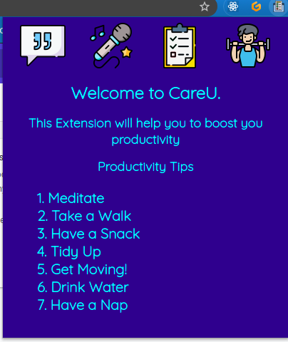

# CareU
A Chrome extension which helps you to boost you productivity!
This Extension provides various feature like Todo List with progress tracking Functionality , Generate Random Motivational Quotes , Accessing Youtube Songs Playlist Easily, few Exercise poses for Stretching during break  

## Features :sparkles:
- :six_pointed_star: Random Quotes for Daily Motivation 
- :memo: Task Manager
-  :musical_note:  Music Playlists
-  :lotus_position_man: Simple Yoga Suggestions

## ScreenShots :camera_flash:

## Demo Video  :movie_camera:
https://www.youtube.com/watch?v=fSQccpqa1a8&ab_channel=Naiksachin

## How to Use :computer:
1. Download or clone the repo.
2. Go to chrome://extensions/
3. Turn on the developer mode (at the top right corner).
4. Select "Load unpacked".
5. Select the downloaded folder. 

## Technologies Used :hammer_and_wrench:
1. HTML.
2. CSS.
3. JavaScript & Jquery.

## Contribute 
-:earth_asia: Feel Free to Contribute to the Project with extra functionalities .
