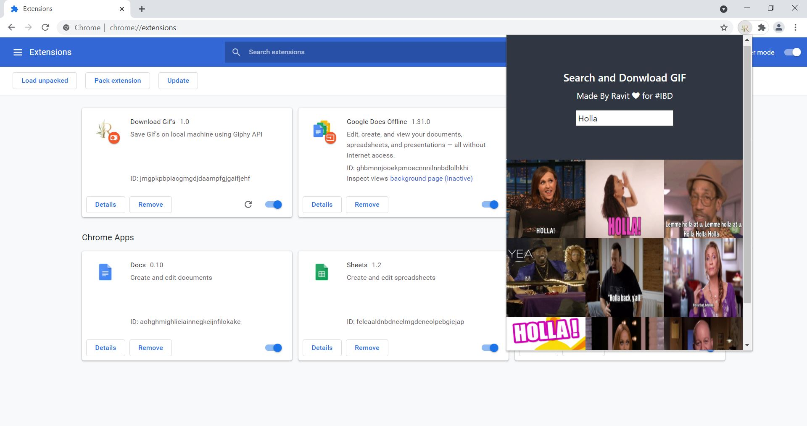

# Chrome-Extension-Gif Downloader Via Giphy API

This extension allows a user to search and download GIF's on a local machine.

- This Extension is Built using Javascript and follows all Chrome's **Content Security Policy** Restrictions.

- For Demo Video, [Click Here]().

## Procedure to Install
- You Can donwload th root folder or fork it and clone to your local machine.
- Then go to ``chrome://extensions`` or ``edge://extensions`` or ``brave://extensions`` depending on Chromium Browser.
- Click load unpacked package and simply select the root folder.
- Voila ! There's your Chrome Extension Up and Running.

## Any Type of Suggestion is welcome
- Made by Ravit Garg