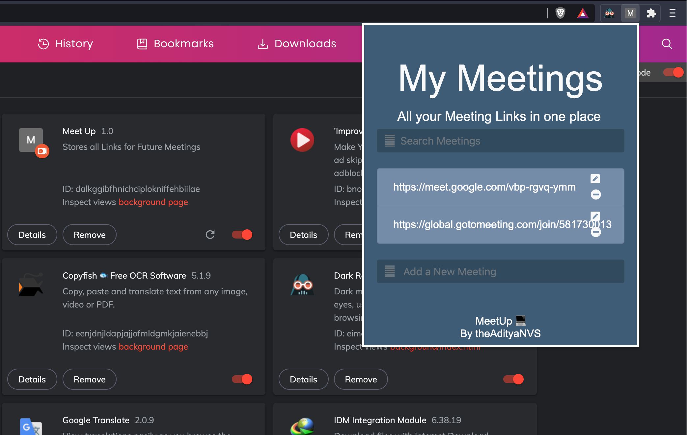

# Chrome-Extension-MeetUp
Its a simple extension which store all your meeting links together in one place and in one click you can join quickly.
- This Extension is Built using Javascript and follows all Chrome's **Content Security Policy** Restrictions.
- It also uses **Local Storage**, so your links are not deleted when exited.
- For better UI, I have used frameworks l like **Bootstrap 5** and **JQuery**.
- Its Easy, Fast and Reliable tool for all your meet links.
- For Demo Video, [Click Here](https://youtu.be/IN1LkECrw5o).

###Functions
- Add a New Meeting
- Search a Meeting
- Delete a Meeting
- Rename a Meeting

## Procedure to Install
- You Can donwload th root folder or fork it and clone to your local machine.
- Then go to ``chrome://extensions`` or ``edge://extensions`` or ``brave://extensions`` depending on Chromium Browser.
- Click load unpacked package and simply select the root folder.
- Voila ! There's your Chrome Extension Up and Running.

### NOTE
- For Web Preview For Extension, Click [Here](https://meetup-ibd.herokuapp.com/). ( **Web Preview of this extension, may not look exact since it uses ``Chrome's Content Security Policy`` and also may face minor bugs** ).
- Will Be Published to Chrome Store Soon

## Work In Progress ⚙️
- Publish to Chrome Store
- UI upgrade.