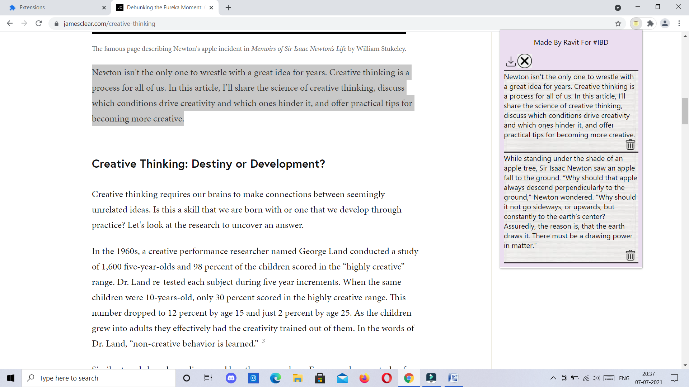

# Chrome-Extension-NotesTaker

This extension is used to extract useful information from the webpages in the form of notes and then download the notes to your local machine for future use.

## Demo Video
- For Demo Video, [Click Here](https://youtu.be/PWAq1EMiMPM).

## ScreenShot

## Functions
- Take notes from webpages.
- Can delete individual notes.
- Can delete all notes in one click.
- Download the notes to your local machine.

## Procedure to Install
- You Can donwload the root folder or fork it and clone to your local machine.
- Then go to ``chrome://extensions`` or ``edge://extensions`` or ``brave://extensions`` depending on Chromium Browser.
- Ensure developer mode is ticked(its on the top right)
- Click load unpacked package and simply select the root folder.
- Voila ! There's your Chrome Extension Up and Running.

## Author
- Made by Ravit Garg

## Contribute
- Feel free to contribute in the project.
