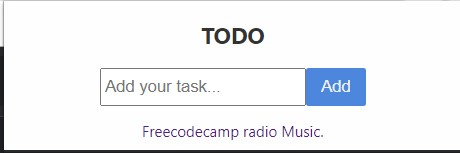
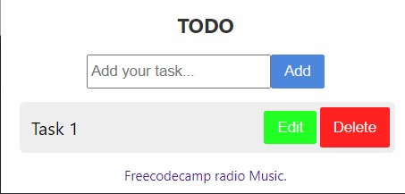
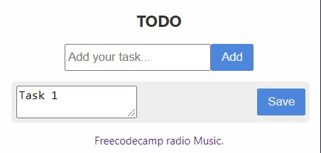
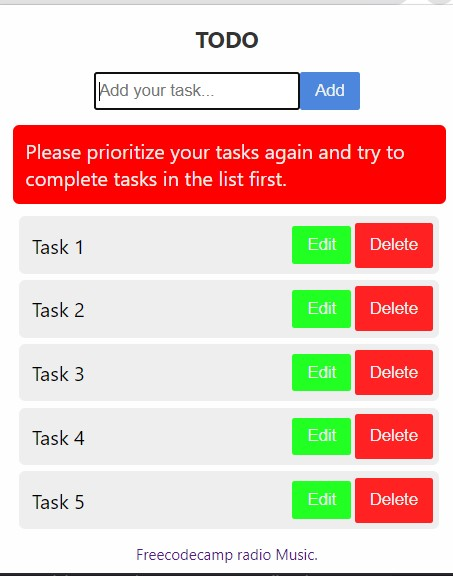

# Todo Chrome Extension

Simple Todo Extension to increase productivity

- Limits the number of tasks
- Built with HTML,CSS,Vanilla JS
- Contains link to freecodecamp radio server
- Uses Chrome Storage API to save tasks
- For Video Demonstration [Click here](https://youtu.be/m0BrXTOT4Zg)

Initial ui\

After adding a task\

During Editing\

Adding More Tasks\

### Functions

- Add a New Task
- Edit the task
- Delete the task
- Persistent Storage

## Procedure to Install

- Donwload th root folder or fork it and clone to your local machine.
- Then go to `browser_Name://extensions`
- Make Sure developer mode is enabled in your browser
- Click Load Unpacked package and simply select the root folder.
- Now Extension is ready for use in browser

## Work in progress

- More changes to increase productivity

Feel free to contribute
