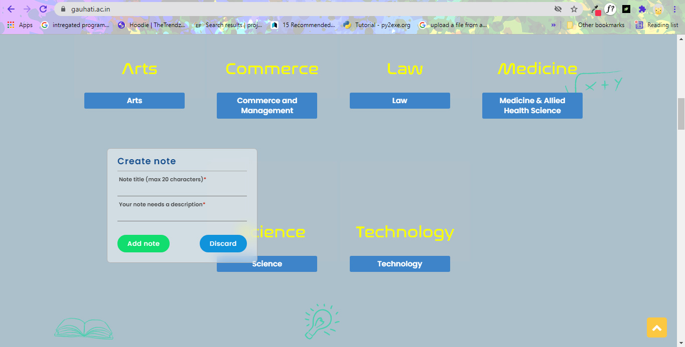
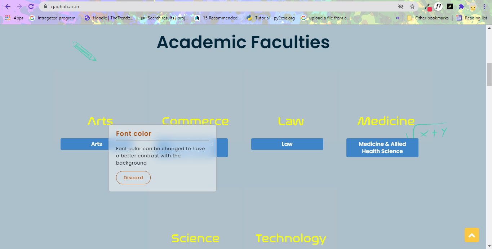
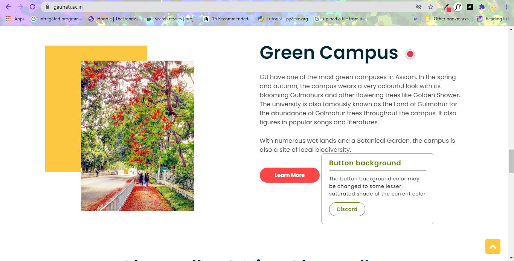
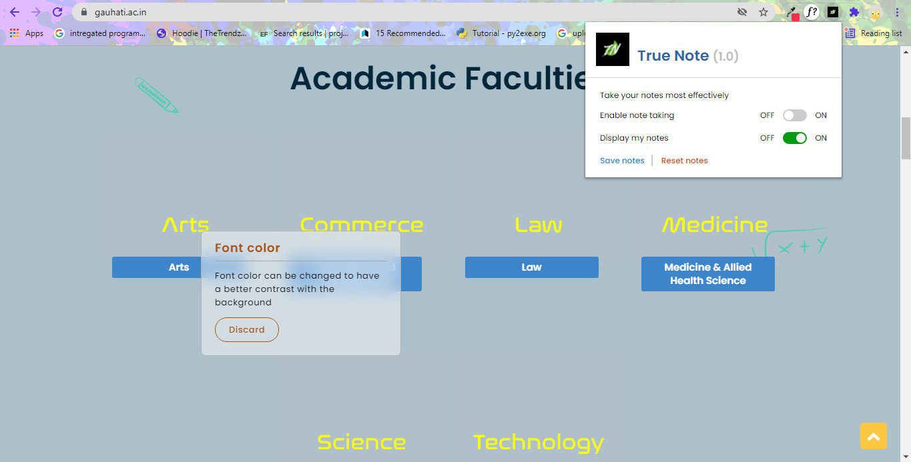
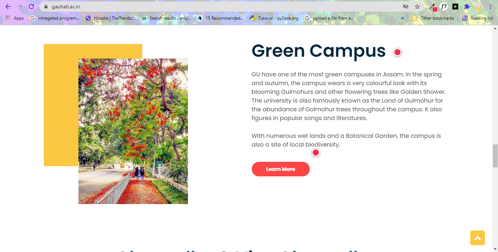

# True Note (v 1.0)

[Demo video link](https://youtu.be/EibNoVMeA90)

## :star2: Features
* Instant note taking.
* More illustrative notes.
* On screen note taking.
* Notes can be sticked to any point on the webpage for better context reference.
* Notes can be saved to the memory.
* Unwanted notes can be deleted.
* All notes can be deleted at once.
* Notes can be shrinked and expanded.
* Users can choose to display or hide their notes on the screen.

## :eyes: Screenshots
> Clicking on any point on the screen to show the form for creating a note 

>Note added at the selected point on the screen after clicking Add note button on the form 

>Showing a shrinked and expanded note 

>Showing user options on the popup screen 

>Shrinked notes as markers 

## :snowflake: Use cases
* Can be used to review live UIs.
* Can be used to take quick and informative notes while researching or surfing the internet.

## :sunflower: Future scope
* I am working on its collaborative features, where users will be able to share their notes with others.
* Users will be able to indulge in other collaborative activities.
* More attractive UI components.

Surely excited for the future versions to come.

## :computer: How to install
1. Download this repository.
2. Open chrome extension tab (chrome://extensions).
3. Turn on developer mode.
4. Click on Load unpacked and select the downloaded folder.

## :construction_worker: Authors
> Manish Das

