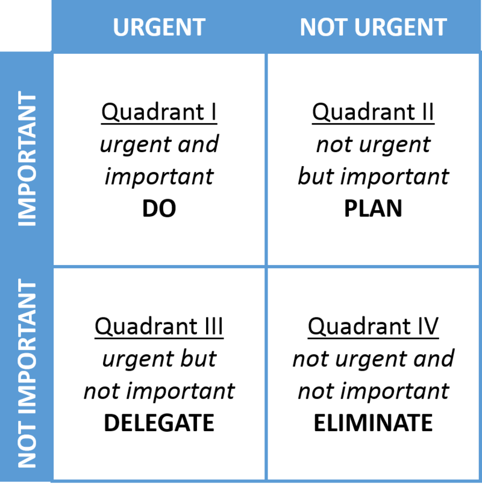

<!-- PROJECT LOGO -->
 

  

  <h3 align="center">WFHTool</h3>

  

    A chrome extension to increase productivity at work
     
  

<!-- TABLE OF CONTENTS -->

  
Table of Contents

  <ol>
    <li>
      <a href="#about-the-project">About The Project</a>
      <ul>
        <li><a href="#built-with">Built With</a></li>
      </ul>
    </li>
    <li>
      <a href="#getting-started">Getting Started</a>
      <ul>
        <li><a href="#installation">Installation</a></li>
         <li><a href="#Demo">Demo</a></li>
      </ul>
    </li>
    <li><a href="#contact">Developed by</a></li>
    <li><a href="#acknowledgements">Acknowledgements</a></li>
    <li><a href="#futurescope">Future Scope</a></li>
  </ol>

<!-- ABOUT THE PROJECT -->
## About The Project

This WFHTool extension solves 4 major challenges in a work from home environment.

1. Motivation - This extension makes an attempt to keep up the motivation by displaying <strong>motivational quotes</strong> which will get updated every day,every 25 minutes and on click of the quote area.
2. Distractions - In my opinion, distractions are the major blockers to be more productive at work, So this tool will provide you a way where you can add all the sites that are causing your distractions and <strong>block them</strong>. Can <strong>unblock and delte</strong> a site from the list at anytime in case of urgency!
3. Organising - Organising plays a very important role in getting things done in a effective manner. This extension provides a todo list where you can add the things that needs attention and can keep track on them by using a checkbox when completed and delete if not necessary to be displayed on the list.
4. Prioritizing - Sometimes having a list of todos is not sufficient to prioritize . A decision making matrix can come in handy in such situations. This helps in prioritizing the todos according to their importance and urgency. Please refer to this to know more about decision making matrix [https://en.wikipedia.org/wiki/Decision-matrix_method]  
          

### Built With

This section should list any major frameworks that you built your project using. Leave any add-ons/plugins for the acknowledgements section. Here are a few examples.
* [HTML]
* [CSS]
* [JQuery]

<!-- GETTING STARTED -->
## Getting Started
 Please follow these steps to execute the extension

### Installation
    
1. Download the project
2. Open Google Chrome,go to chrome://extensions and click on Load unpacked extension.
3. This will direct you to your local file explorer. Select the path where manifest.json is present  
   [https://github.com/kavya466/Chrome-extensions/tree/main/WFHTool%20-%20JavaScript/src]
  
4. Done! you should be able to use the extension now when you open a new tab and also a todo list view is available on window bar

<!-- CONTACT -->
## Developed by

Kavya Sri Gurram 
