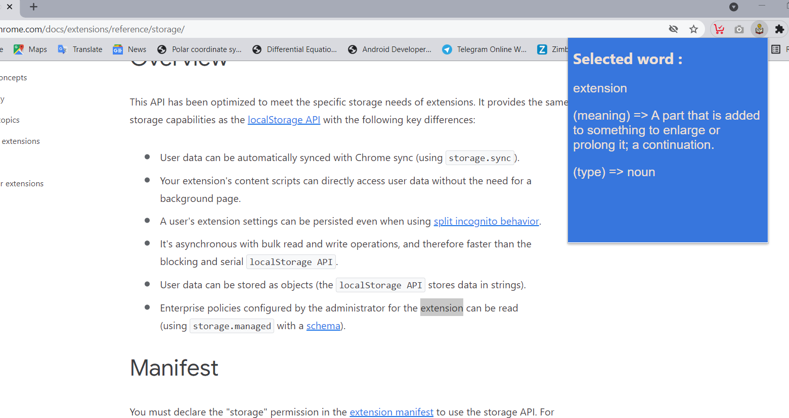

# Word Nest (Chrome Extension)
A Chrome extension which helps to know the meaning of unknown word !
This Extension helps to know the meaning and type of selected word from a web page  

## Features :
📖showing the meaning of selected word

## ScreenShots :camera_flash:

## How to Use :computer:
1. Download or clone the repo.
2. Go to chrome://extensions/
3. Turn on the developer mode (at the top right corner).
4. Select "Load unpacked".
5. Select the downloaded folder. 

## Technologies Used :hammer_and_wrench:
1. HTML.
2. CSS.
3. JavaScript .
4. p5.js library

## Contribute 
👨‍💻: Feel Free to Contribute to the Project with extra functionalities .
 
